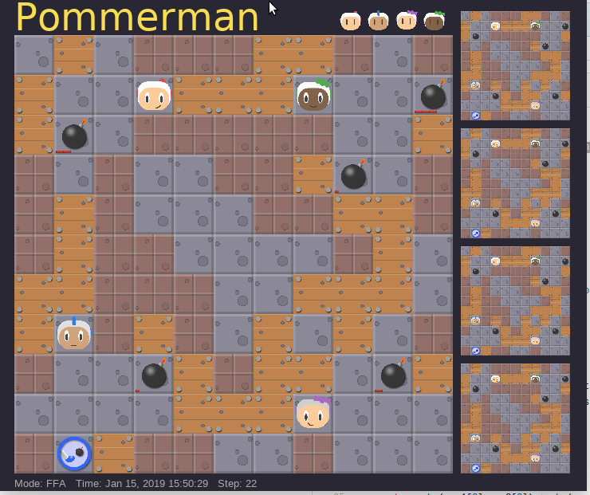

# pommerman-baseline
[Pommerman](https://github.com/MultiAgentLearning/playground) baseline using action filter 

Chao Gao, Pablo Hernandez-Leal, Bilal Kartal, and Matthew E. Taylor "Skynet: A Top Deep RL Agent in the Inaugural Pommerman Team Competition". 4th Multidisciplinary Conference on Reinforcement Learning and Decision Making (2019) 

and here's a BibTeX entry that you can use to cite it in a publication:
```
@inproceedings{gao2019skynet,
  author = {Chao Gao and Pablo Hernandez-Leal and Bilal Kartal and Taylor, Matthew E.},
  title = {Skynet: A Top Deep RL Agent in the Inaugural Pommerman Team Competition},
  year = {2019},
  booktitle={4th Multidisciplinary Conference on Reinforcement Learning and Decision Making},
}
```

## What is ActionPruning (or Action Filter)? 

It is an module for Pommerman. 
As the name indicates, it prunes actions that would surely lead the agent to death, given
the bombs nearby.The safety of each cell can be computed by comparing the minimum number of steps to evade and the 
minimum bomb life value covering this cell. 

This implementation is an **upgraded** (and arguably stronger) version of the ActionFilter used in skynet955.

## How to Use? 
In your your agent, call 
```py
import action_prune
actions = action_prune.get_filtered_actions(observation)
```
where `observation` is the agent observation received by the 
agent while calling the `step` function in Pommerman environment. 

## As baselines for Pommerman
It is natural to build a few players using this action filter module. 
More specifically, random player with 3 different bombing action prune
options. 

1. `simple`: simply not place a bomb when the agent's position is covered by some bomb nearby. 
2. `simple_adjacent`: similar to 1., but also apply the test to the agent's adjacent passable cells. 
3. `lookahead`: try place a bomb, then call the action pruning algorithm, if all actions are pruned, which means the agent is probably doomed to die, then placing bomb action should be avoided.  

For example, the following defines a player that takes actions randomly (including placing bombs) using the filter. 
```py
class SmartRandomAgent(BaseAgent):
    """ random with filtered actions"""
    def act(self, obs, action_space):
        valid_actions=action_prune.get_filtered_actions(obs)
        if len(valid_actions) ==0:
            valid_actions.append(Action.Stop.value)
        return random.choice(valid_actions)

    def episode_end(self,reward):
        pass
```

We also release a similar agent which uses the filter and only moves randomly, this is, it does not place bombs.
```py
class SmartRandomAgentNoBomb(BaseAgent):
    """ random with filtered actions but no bomb"""
    def act(self, obs, action_space):
        valid_actions=action_prune.get_filtered_actions(obs)
        if Action.Bomb.value in valid_actions:
            valid_actions.remove(Action.Bomb.value)
        if len(valid_actions) ==0:
            valid_actions.append(Action.Stop.value)
        return random.choice(valid_actions)
```

Lastly, we provide an agent which is based on a modification of `SimpleAgent`, the main idea is to only let this agent place a bomb when it is certain to kill an opponent, this agent we named as `CautiousAgent`.
```py
class CautiousAgent(BaseAgent):
```

## Results Against SimpleAgent

We use the following script to test the effective of the action filter, where `SmartRandomAgent` is a player who plays randomly after prunning actions using the filter.

```py
'''An example to show how to set up an pommerman game programmatically'''
import os
import sys
import pommerman
from pommerman import agents
from pommerman.agents import random_agent

ENV_ID='PommeFFACompetition-v0'
RENDER=True
N_game=20
#ENV_ID="PommeTeamCompetition-v0"

def main():
    # Print all possible environments in the Pommerman registry
    print(pommerman.REGISTRY)
    print(ENV_ID)
    # Create a set of agents (exactly four)
    agent_list = [
        random_agent.SmartRandomAgent(),
        agents.simple_agent.SimpleAgent(),
        agents.simple_agent.SimpleAgent(),
        agents.simple_agent.SimpleAgent(),
    ]
    # Make the "Free-For-All" environment using the agent list
    env = pommerman.make(ENV_ID, agent_list)
    # Run the episodes just like OpenAI Gym
    win_cnt=0; draw_cnt=0; lost_cnt=0
    for i_episode in range(N_game):
        state = env.reset()
        done = False
        step_cnt=0
        while not done:
            if RENDER: env.render()
            actions = env.act(state)
            state, rewards, done, info = env.step(actions)
            step_cnt +=1
        if rewards[0]>0: win_cnt +=1
        elif step_cnt>=800: draw_cnt +=1
        else: lost_cnt = lost_cnt + 1
        print('Episode {} finished'.format(i_episode))
    print('win:', win_cnt, 'draw_cnt:', draw_cnt, 'lose_cnt:', lost_cnt)
    print('\n')
    env.close()

if __name__ == '__main__':
    main()
```

Using the above script and `option 2`, running results of 100 games, four trials starting from different corners: 

1. win 45, draw  7, lose 48 
2. win 34, draw 14, lose 52
3. win 45, draw 10, lose 45
4. win 34, draw 13, lose 53

Give the observation that a player with similar strength to `SimpleAgent` should yield win probability around 0.25, the above results show that the action filter is quite effective --- even a random player with such a filter could perform better than a well-designed search agent baseline. 

Notice the `strategy flaw` of `SimpleAgent` is due to its deterministic strategy, we 
believe that the `Random with action filter` player might be a good baseline for pommerman for training and testing.

An example game: 

Another use is to plug in this filter into a learning algorithm, as we did for `skynet955`. 

### Further Development
Further development is possible, perhaps in the following directions: 

+ considering other agent's moves, current code treats all other agents as static.

## Licence 
See the [COPYING](LICENSE) file for details
